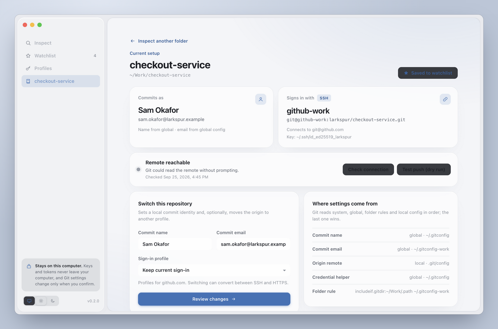
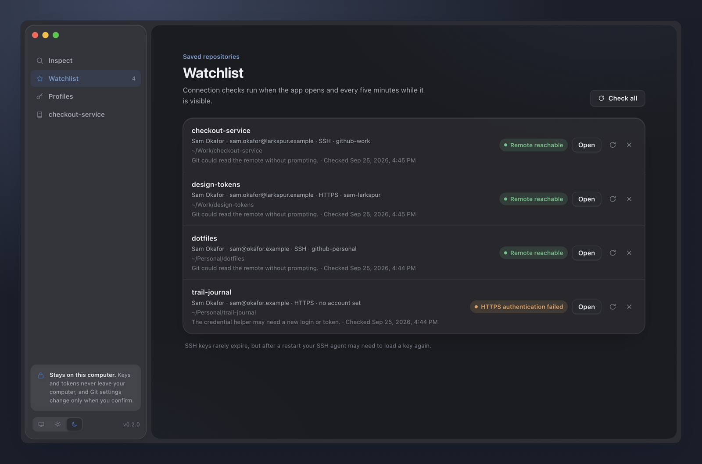
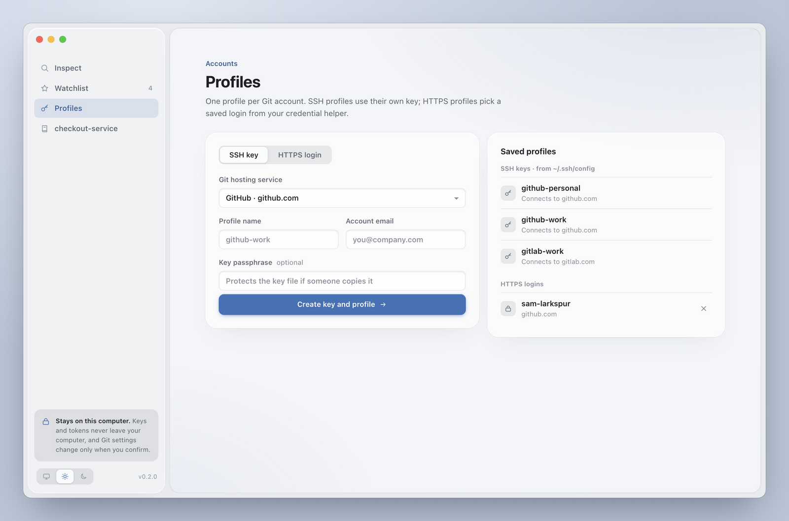
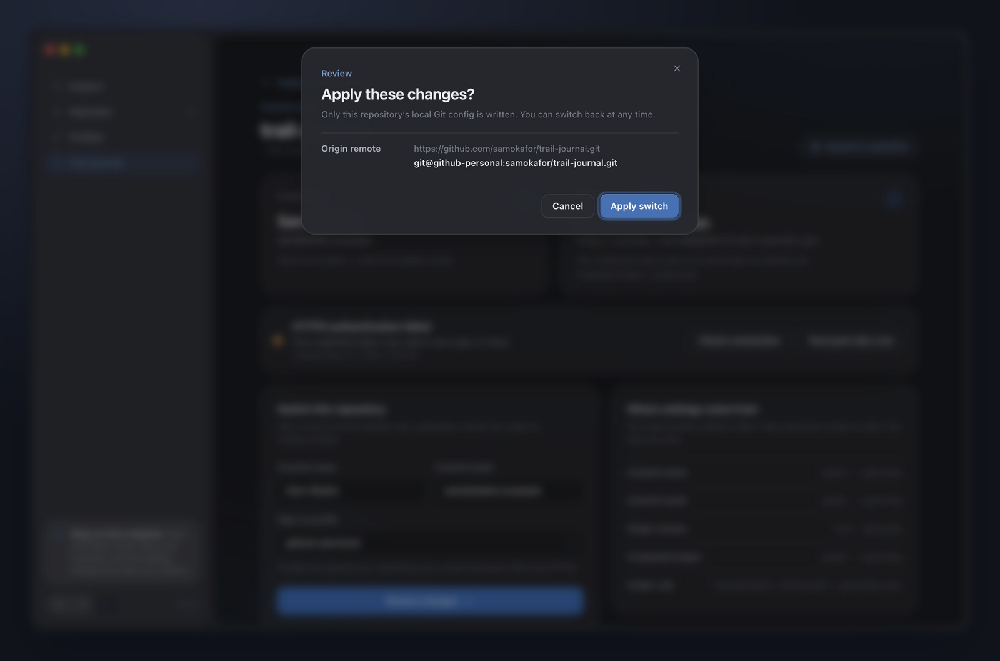

# Git Profile Map

**Stop pushing work code with your personal account, or the other way round.**

Git Profile Map is a small desktop app for people with more than one Git account. Point it at any repository and it shows who you'll commit as, which account Git will sign in with, and which config file each setting comes from. Then you can switch that repository to another account after reviewing exactly what will change.



<sub>Screenshots use a made-up user and made-up repositories.</sub>

## What it does

- **Shows the real answer, not a guess.** Name, email, remote and SSH key are read the same way Git and OpenSSH resolve them, including folder rules (`includeIf`), `Include`d SSH config files, and push URLs.
- **One profile per account.** Each profile is either its own SSH key or an HTTPS login, for GitHub, GitLab or Bitbucket.
- **Safe switching.** Every change is shown before it is written, only to that repository's local config, and rolled back if anything fails. A switch can move a repository from HTTPS to SSH or back.
- **Watchlist.** Keep an eye on the repositories you care about: the app checks each one when it opens and every five minutes. It tells an expired login apart from a network problem.
- **Local only.** Private keys never leave `~/.ssh`, tokens go straight to your system keychain, and nothing is uploaded anywhere.

<table>
  <tr>
    <td width="50%"></td>
    <td width="50%"></td>
  </tr>
  <tr>
    <td><b>Watchlist.</b> Every saved repository, which account it uses, and whether it can still connect.</td>
    <td><b>Profiles.</b> Create an SSH key or an HTTPS login for each account.</td>
  </tr>
</table>



## Install

Download the installer for your system from the [latest release](https://github.com/mromoli/git-profile-map/releases/latest): `.dmg` for macOS, `.exe` for Windows, `.AppImage` or `.deb` for Linux. You need Git and OpenSSH installed.

The macOS build is not code-signed yet, so on first launch right-click the app and choose **Open**, or run:

```sh
xattr -dr com.apple.quarantine "/Applications/Git Profile Map.app"
```

## How profiles work

A profile is one Git account on one host.

- **SSH key.** The app creates a separate Ed25519 key and a named `Host` alias (like `github-work`) in `~/.ssh/config`, then shows the public key and opens the account's SSH key page so you can add it. The private key stays in `~/.ssh`. The new block goes before any `Host *` or `Match` block, so a catch-all key can't sign you in as the wrong account.
- **HTTPS login.** A host and a username. If you paste a personal access token, the app hands it to Git's own credential helper (macOS Keychain, Git Credential Manager, libsecret) with `git credential approve`. The app never stores tokens itself. Leave it empty and Git will ask you to sign in the first time.

Creating a profile doesn't change any repository. Open a repository and pick a profile under **Switch this repository**.

### What a switch writes

After you confirm, the app writes `user.name` and `user.email` to the repository's local Git config. If you picked a profile, it also rewrites `origin` (and its push URL, if one is set), either to that SSH alias or to a clean HTTPS URL plus a local `credential.https://<host>.username`. It never touches your SSH config or global Git config, and a failed switch restores every value it changed.

### What it reads

- Effective `user.name`, `user.email`, origin and push URLs, credential helper and `core.sshCommand`, with the file and scope Git reports for each.
- OpenSSH's resolved host, user and identity files from `ssh -G`.
- `Host` aliases in `~/.ssh/config` and the files it `Include`s.

It never opens private key files or reads stored credentials. Inspecting a repository reads only local configuration; only connection checks contact the remote. **Test push (dry run)** asks the server whether it would accept a push without uploading anything. Server rules can still reject the real push. A token embedded in a remote URL is hidden in the window and flagged.

## Development

Requires Node.js 20+, Git and OpenSSH.

```sh
npm install
npm start          # run the app
npm test           # unit and integration tests in temporary repositories
npm run dist       # build installers for the current OS into dist/
npm run screenshots  # regenerate docs/screenshots from a fictional setup (macOS/Linux)
```

Tests and the screenshot script redirect Git, SSH config and app data to temporary folders, so they never touch your real accounts or credentials.

### Releases

Pushing a tag that matches `version` in `package.json` runs the tests, builds installers for macOS, Windows and Linux on GitHub Actions, and attaches them to a **draft** release that you review and publish:

```sh
npm version minor   # bumps package.json and creates the v0.x.0 tag
git push --follow-tags
```
